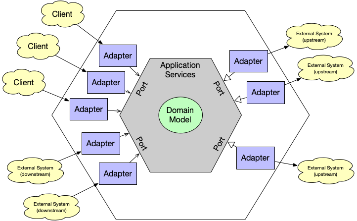

## Introducción al Diseño Orientado al Dominio (DDD)

El Diseño Orientado al Dominio (DDD, por sus siglas en inglés) es una metodología introducida por Eric Evans en su libro *"Domain-Driven Design: Tackling Complexity in the Heart of Software"*. Esta metodología se enfoca en alinear el desarrollo de software con los objetivos y procesos de negocio de una organización. DDD fomenta la creación de un lenguaje ubicuo compartido entre desarrolladores y expertos en el dominio, reduciendo malentendidos y asegurando que la solución desarrollada refleje fielmente las necesidades del negocio.

### Pilares del DDD

1. **Lenguaje Ubicuo:** Un vocabulario compartido que todos los involucrados en el proyecto entienden y utilizan.
2. **Contextos Delimitados:** Definición clara de los límites dentro de los cuales un modelo de dominio es válido, permitiendo que diferentes modelos coexistan dentro de una aplicación más grande.
3. **Patrones de Diseño de Dominio:** Incluye entidades, agregados, servicios, repositorios y fábricas, entre otros.

## Introducción a la Arquitectura Hexagonal

La Arquitectura Hexagonal, desarrollada por Alistair Cockburn, también conocida como Arquitectura de Puertos y Adaptadores, propone una forma de estructurar sistemas de software de modo que sean independientes de sus detalles técnicos, permitiendo que estos detalles se cambien sin afectar la lógica de negocio.

### Componentes Clave

1. **Núcleo:** Contiene toda la lógica de negocio y es independiente de la tecnología de infraestructura.
2. **Puertos:** Interfaces que permiten al núcleo interactuar con el mundo exterior.
3. **Adaptadores:** Implementaciones de los puertos que manejan las interacciones con sistemas externos, como bases de datos, APIs e interfaces de usuario.

## Beneficios de Combinar DDD y Arquitectura Hexagonal

1. **Aislamiento de la Lógica de Negocio:**
   La combinación de DDD con Arquitectura Hexagonal asegura que la lógica de negocio permanezca pura y no se vea afectada por detalles técnicos. Esto facilita la comprensión, el mantenimiento y la modificación de la lógica central sin impactar las partes externas del sistema.

2. **Flexibilidad y Adaptabilidad:**
   La independencia de los detalles de infraestructura significa que se pueden actualizar o reemplazar tecnologías sin tener que reescribir la lógica de negocio. Esto es crucial para mantener la relevancia y competitividad del sistema en un entorno tecnológico en constante cambio.

3. **Escalabilidad Modular:**
   La clara separación de responsabilidades y la definición de contextos delimitados permiten que los sistemas crezcan de manera orgánica. Se pueden añadir nuevas funcionalidades o adaptar las existentes con un impacto mínimo en otras partes del sistema.

4. **Facilita la Colaboración:**
   El lenguaje ubicuo y los modelos compartidos mejoran la comunicación entre desarrolladores y expertos en el dominio, reduciendo errores y malentendidos y aumentando la velocidad de desarrollo.

5. **Mejor Mantenibilidad y Testabilidad:**
   Con la lógica de negocio aislada, las pruebas unitarias y de integración se vuelven más fáciles de implementar. Los desarrolladores pueden probar cada componente de forma aislada, asegurando que cada parte funcione como se espera.

## Posibles Desventajas

1. **Complejidad Inicial:**
   Implementar DDD y Arquitectura Hexagonal puede ser complejo, especialmente en las primeras etapas del proyecto. Requiere un compromiso significativo para entender y modelar el dominio de manera efectiva.

2. **Sobrecarga Arquitectónica:**
   Para proyectos más pequeños, la complejidad añadida de estas metodologías puede superar sus beneficios. Es crucial evaluar si la inversión en DDD y Arquitectura Hexagonal está justificada por la escala y los objetivos del proyecto.

3. **Requiere Colaboración Cercana:**
   El éxito de DDD depende en gran medida de la colaboración entre desarrolladores y expertos en el dominio. Si esta colaboración no es efectiva, puede llevar a modelos de dominio inexactos o incompletos.

## Implementación Paso a Paso

1. **Involucrar a los expertos del dominio desde el principio** para entender profundamente el negocio y definir un lenguaje ubicuo.
2. **Identificar y definir los contextos delimitados** dentro de la aplicación para gestionar la complejidad y asegurar que cada parte del dominio se modele adecuadamente.
3. **Diseñar los puertos y adaptadores necesarios** para permitir que la aplicación central interactúe con sistemas externos sin depender de detalles de implementación específicos.
4. **Implementar adaptadores** para manejar interacciones con bases de datos, interfaces de usuario y servicios externos de manera independiente del núcleo.
5. **Desarrollar un conjunto robusto de pruebas** para validar la funcionalidad del sistema, incluyendo pruebas unitarias, de integración y de aceptación del usuario.

## Conclusión

Integrar el Diseño Orientado al Dominio con la Arquitectura Hexagonal proporciona un enfoque poderoso para el desarrollo de software que puede adaptarse a las necesidades cambiantes del negocio y la tecnología. Aunque la curva de aprendizaje y el esfuerzo inicial pueden ser significativos, los beneficios en términos de flexibilidad, mantenibilidad y alineación con el negocio hacen que este enfoque sea valioso para las organizaciones que buscan construir sistemas duraderos y escalables.
