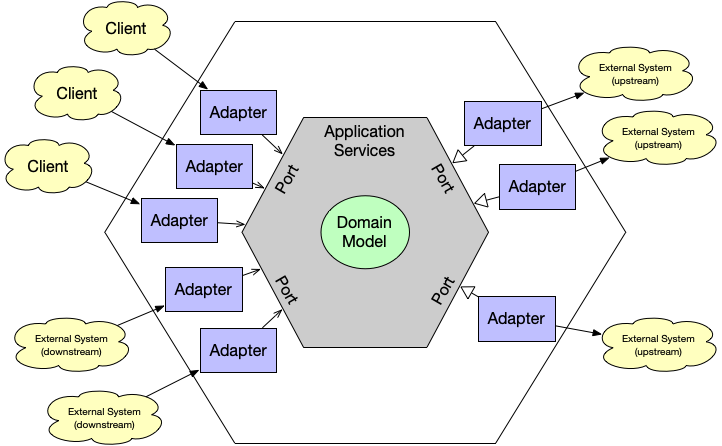

## Introduction to Domain-Driven Design (DDD)

Domain-Driven Design (DDD) is a methodology introduced by Eric Evans in his book *"Domain-Driven Design: Tackling Complexity in the Heart of Software"*. This methodology focuses on aligning software development with an organization's business goals and processes. DDD fosters the creation of a ubiquitous language shared among developers and domain experts, reducing misunderstandings and ensuring that the developed solution faithfully reflects business needs.

### Pillars of DDD

1. **Ubiquitous Language:** A shared vocabulary that everyone involved in the project understands and uses.
2. **Bounded Contexts:** Clear definition of boundaries within which a domain model is valid, allowing different models to coexist within a larger application.
3. **Domain Design Patterns:** Includes entities, aggregates, services, repositories, and factories, among others.

## Introduction to Hexagonal Architecture

Hexagonal Architecture, developed by Alistair Cockburn, also known as Ports and Adapters Architecture, proposes a way to structure software systems so they are independent of their technical details, allowing these details to be changed without affecting business logic.

### Key Components

1. **Core:** Contains all the business logic and is independent of the infrastructure technology.
2. **Ports:** Interfaces that allow the core to interact with the outside world.
3. **Adapters:** Implementations of the ports that handle interactions with external systems, such as databases, APIs, and user interfaces.

## Benefits of Combining DDD and Hexagonal Architecture

1. **Isolation of Business Logic:**
   The combination of DDD with Hexagonal Architecture ensures that business logic remains pure and unaffected by technical details. This makes understanding, maintaining, and modifying the core logic easier without impacting external parts of the system.

2. **Flexibility and Adaptability:**
   The independence from infrastructure details means you can update or replace technologies without having to rewrite business logic. This is crucial for maintaining the relevance and competitiveness of the system in a constantly changing technological environment.

3. **Modular Scalability:**
   The clear separation of responsibilities and the definition of bounded contexts allow systems to grow organically. You can add new functionalities or adapt existing ones with minimal impact on other parts of the system.

4. **Facilitates Collaboration:**
   The ubiquitous language and shared models improve communication between developers and domain experts, reducing errors and misunderstandings and increasing development speed.

5. **Better Maintainability and Testability:**
   With business logic isolated, unit and integration tests become easier to implement. Developers can test each component in isolation, ensuring that each part works as expected.

## Potential Disadvantages

1. **Initial Complexity:**
   Implementing DDD and Hexagonal Architecture can be complex, especially in the early stages of the project. It requires a significant commitment to understanding and modeling the domain effectively.

2. **Architectural Overhead:**
   For smaller projects, the added complexity of these methodologies can outweigh their benefits. It’s crucial to assess whether the investment in DDD and Hexagonal Architecture is justified by the project’s scale and objectives.

3. **Requires Close Collaboration:**
   The success of DDD heavily relies on collaboration between developers and domain experts. If this collaboration is not effective, it can lead to inaccurate or incomplete domain models.

## Step-by-Step Implementation

1. **Engage domain experts early on** to deeply understand the business and define a ubiquitous language.
2. **Identify and define the bounded contexts** within the application to manage complexity and ensure each part of the domain is modeled appropriately.
3. **Design the necessary ports and adapters** to allow the core application to interact with external systems without depending on specific implementation details.
4. **Implement adapters** to handle interactions with databases, user interfaces, and external services in a way that is independent of the core.
5. **Develop a robust suite of tests** to validate the system's functionality, including unit, integration, and user acceptance tests.

## Conclusion

Integrating Domain-Driven Design with Hexagonal Architecture provides a powerful approach to software development that can adapt to changing business and technological needs. While the learning curve and initial effort may be significant, the benefits in terms of flexibility, maintainability, and alignment with the business make this approach valuable for organizations looking to build durable and scalable systems.
